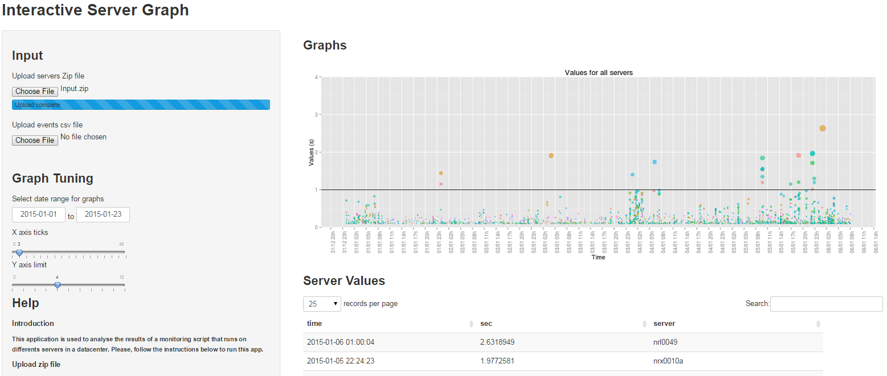

## Presentations

This application is used to analyze the results of a monitoring script that runs on different servers in a datacenter. You can find it here:

<http://coursera1.shinyapps.io/DDP-Project>.

The monitored values are plotted on the Y axis and colored by server names. The size of the dots were made proportional to the values to make them more visible as these points are more important for the analysis.

You can play around with the graph tuning parameters:

- the date range (to zoom in-out on the x axis), 
- the y axis limit (to zoom in-out on the y axis)
- the x axis tick

## ui.R
The complete code can be found here:

<http://github.com/coursera1/DDP-Project/blob/master/ui.R>

Here are the descriptions of the inputs and outputs:
```{r, eval=FALSE}
fileInput("serverZip", "Upload servers Zip file", multiple=FALSE, accept="application/zip"),
fileInput("eventsCsv", "Upload events csv file", multiple=FALSE, accept="text/csv"),
dateRangeInput("dateRange", "Select date range for graphs", start="2014-11-01"),
sliderInput("breaks", "X axis ticks", 0, 48, 6, 3, round=TRUE),
sliderInput("yLimit", "Y axis limit", 0, 10, 4, 1, round=TRUE)),
...
plotOutput("G1"),
h3("Server Values"),
dataTableOutput("serverValue"),
h3("Events"),
dataTableOutput("tEvents")
```

## server.R
The complete code can be found here:

<https://github.com/coursera1/DDP-Project/blob/master/server.R>

Here is the main plotting code and a graph example below:
```{r, eval=FALSE}
qplot(time, sec, data=fData, col=server, geom="point", alpha=0.7, size=sec, 
      main="Values for all servers", xlab="Time", ylab="Value (s)") +
        scale_x_datetime( breaks=xBr, labels = date_format("%d/%m %Hh")) +
        geom_hline(yintercept=1) +
        geom_vline(xintercept=as.numeric(fEvents$time)) +
        theme(axis.text.x = element_text(angle = 90, hjust = 1)) +
        coord_cartesian(ylim = c(0, input$yLimit)) +
        theme(legend.position = "none")
```

```{r, eval=TRUE, echo=FALSE}
suppressMessages(library(dplyr))
library(ggplot2)
library(grid)
library(scales)
library(lubridate)

# Create example dataframe of 100 samples
ndat<-c("2015-01-05 11:01:01","2014-12-01 17:57:59","2014-12-20 02:37:37","2014-12-26 22:46:39","2014-12-29 17:13:39","2014-12-15 01:05:40","2014-12-29 12:21:38","2014-11-30 22:16:35","2014-12-30 09:01:39","2015-01-06 02:22:15","2014-11-27 17:16:01","2014-12-18 16:45:17","2014-12-29 01:46:39","2014-12-17 12:53:37","2015-01-05 17:16:39","2014-12-19 11:17:57","2014-12-27 09:26:39","2015-01-01 23:05:40","2015-01-06 03:48:19","2014-11-28 11:38:35","2014-11-29 10:05:04","2014-12-08 05:39:40","2014-12-03 11:47:49","2014-11-28 11:38:35","2014-12-26 00:18:37","2014-12-27 12:54:08","2014-12-16 15:30:34","2015-01-05 14:19:39","2014-12-05 22:40:05","2014-11-25 11:41:05","2015-01-05 17:50:39","2014-11-24 01:48:39","2014-11-28 21:33:04","2014-12-11 21:03:26","2014-12-19 00:45:30","2014-11-22 20:42:34","2014-12-11 09:11:58","2014-12-07 11:25:12","2014-12-15 10:04:06","2014-12-09 17:22:06","2014-12-29 16:16:01","2014-11-21 20:00:47","2014-12-29 12:10:12","2014-12-15 19:14:28","2015-01-03 19:10:40","2014-12-03 12:00:31","2014-12-02 12:11:05","2014-12-22 10:17:33","2014-12-29 15:57:32","2014-12-18 14:11:52","2014-11-25 07:52:58","2015-01-01 21:50:39","2015-01-01 08:07:21","2014-12-16 14:34:07","2014-12-30 02:58:39","2014-12-18 14:58:17","2014-12-06 03:29:35","2014-12-30 10:03:26","2014-12-23 09:48:39","2014-12-07 11:25:51","2015-01-04 00:50:24","2014-12-29 12:01:22","2014-12-07 22:05:39","2015-01-05 01:02:39","2014-12-29 16:41:45","2014-12-04 17:02:05","2015-01-05 03:24:39","2014-11-30 10:16:34","2014-12-18 14:59:55","2014-12-11 21:03:26","2014-11-24 19:52:04","2014-12-28 22:05:40","2014-12-09 00:13:52","2014-12-26 05:21:38","2014-12-15 15:53:07","2014-12-20 23:33:07","2014-12-21 03:42:16","2014-12-13 07:15:06","2014-12-04 18:00:05","2015-01-06 06:05:39","2014-12-14 16:02:36","2014-12-21 02:08:57","2015-01-02 15:30:40","2014-11-30 12:56:04","2014-12-06 08:22:05","2014-12-29 15:27:19","2014-12-15 21:06:47","2014-12-31 13:22:39","2014-12-21 00:00:01","2014-12-15 18:41:39","2014-12-15 06:27:17","2015-01-05 22:32:39","2014-11-22 05:28:04","2014-11-26 09:44:34","2014-12-12 13:56:06","2014-12-29 14:02:19","2014-12-16 10:05:40","2014-12-29 11:23:05","2015-01-06 01:55:20","2015-01-02 15:15:07")
ndat<-rbind(ndat, c("0.3109780","0.3669849","0.1475640","0.1446930","0.1009210","0.1723951","0.1400541","0.2166050","0.1081120","0.1943401","0.2928849","0.1534999","0.2168749","0.1267539","0.1159321","0.2624322","0.1672228","0.1745440","0.2247408","0.2528451","0.1430541","0.1091419","0.1846839","0.1991399","0.1013781","0.1453541","0.1001001","0.1353830","0.1813510","0.1106969","0.1250931","0.1121560","0.3339399","0.2403990","0.4143830","0.1715349","0.1351870","0.1120211","0.1582030","0.1431631","0.1732939","0.7073909","0.1209382","0.1512581","0.2299429","0.1732391","0.1418060","0.1369771","0.1133960","0.2450610","1.2999919","0.1263691","0.1452049","0.2583159","0.1005031","0.7831391","0.1492301","0.1283432","0.1253119","0.1576940","0.1617812","0.1070128","0.1252409","0.1451181","0.1133100","0.2740289","0.1228550","0.1480940","0.2488581","0.1710320","0.1832591","0.3532670","0.1222418","0.1012410","0.1190392","0.1278821","0.3848752","0.1164189","0.1470049","0.2595359","0.2705768","0.3598960","0.1120659","0.1350752","0.1026188","0.1671592","0.1073321","0.1220220","0.1357261","0.1003731","0.1485590","0.1059190","0.2844490","0.1777109","0.1466392","0.1893810","0.2000860","0.1666668","0.1248230","0.2251230"))
ndat<-rbind(ndat, c("nrx0007","nrx0015","nrx0007","nrx0007","nrx0010a","nrx0007","nrx0007","nrx0018b","enrx0005","enrx0005","nrx0010b","nrx0006","enrx0005","enrx0005","enrx0005","nrx0004","nrx0010b","nrx0010a","nrx0007","nrx0010b","nrx0018b","nrx0010b","nrx0006","nrx0006","enrx0005","nrx0015","nrx0010a","nrx0006","nrx0006","nrx0010b","nrx0007","nrx0025a","nrx0007","nrx0007","nrx0007","nrx0004","nrx0007","nrx0010a","nrx0010b","nrx0015","nrx0007","nrx0014","nrx0002","nrx0018a","nrx0004","nrx0015","enrx0005","nrx0006","nrx0006","nrx0002","nrx0018b","nrx0010b","nrx0004","nrx0002","enrx0005","nrx0006","nrx0014","nrx0007","nrx0010a","nrx0002","nrx0007","nrx0006","nrx0002","enrx0005","nrx0010a","nrx0015","nrx0006","nrx0010a","nrx0007","nrx0010a","nrx0004","nrx0007","nrx0007","nrx0014","nrx0004","nrx0018b","nrx0004","nrx0015","nrx0002","enrx0005","nrx0014","nrx0002","nrx0002","nrx0010a","nrx0018b","enrx0005","nrx0006","nrx0007","enrx0005","nrx0010a","nrx0002","nrx0004","nrx0022","nrx0015","nrx0007","nrx0010a","nrx0010a","nrx0010b","nrx0010b","nrx0002"))
ndat<-rbind(ndat, c("2015-01-05 11:01:01","2014-12-01 17:57:59","2014-12-20 02:37:37","2014-12-26 22:46:39","2014-12-29 17:13:39","2014-12-15 01:05:40","2014-12-29 12:21:38","2014-11-30 22:16:35","2014-12-30 09:01:39","2015-01-06 02:22:15","2014-11-27 17:16:01","2014-12-18 16:45:17","2014-12-29 01:46:39","2014-12-17 12:53:37","2015-01-05 17:16:39","2014-12-19 11:17:57","2014-12-27 09:26:39","2015-01-01 23:05:40","2015-01-06 03:48:19","2014-11-28 11:38:35","2014-11-29 10:05:04","2014-12-08 05:39:40","2014-12-03 11:47:49","2014-11-28 11:38:35","2014-12-26 00:18:37","2014-12-27 12:54:08","2014-12-16 15:30:34","2015-01-05 14:19:39","2014-12-05 22:40:05","2014-11-25 11:41:05","2015-01-05 17:50:39","2014-11-24 01:48:39","2014-11-28 21:33:04","2014-12-11 21:03:26","2014-12-19 00:45:30","2014-11-22 20:42:34","2014-12-11 09:11:58","2014-12-07 11:25:12","2014-12-15 10:04:06","2014-12-09 17:22:06","2014-12-29 16:16:01","2014-11-21 20:00:47","2014-12-29 12:10:12","2014-12-15 19:14:28","2015-01-03 19:10:40","2014-12-03 12:00:31","2014-12-02 12:11:05","2014-12-22 10:17:33","2014-12-29 15:57:32","2014-12-18 14:11:52","2014-11-25 07:52:58","2015-01-01 21:50:39","2015-01-01 08:07:21","2014-12-16 14:34:07","2014-12-30 02:58:39","2014-12-18 14:58:17","2014-12-06 03:29:35","2014-12-30 10:03:26","2014-12-23 09:48:39","2014-12-07 11:25:51","2015-01-04 00:50:24","2014-12-29 12:01:22","2014-12-07 22:05:39","2015-01-05 01:02:39","2014-12-29 16:41:45","2014-12-04 17:02:05","2015-01-05 03:24:39","2014-11-30 10:16:34","2014-12-18 14:59:55","2014-12-11 21:03:26","2014-11-24 19:52:04","2014-12-28 22:05:40","2014-12-09 00:13:52","2014-12-26 05:21:38","2014-12-15 15:53:07","2014-12-20 23:33:07","2014-12-21 03:42:16","2014-12-13 07:15:06","2014-12-04 18:00:05","2015-01-06 06:05:39","2014-12-14 16:02:36","2014-12-21 02:08:57","2015-01-02 15:30:40","2014-11-30 12:56:04","2014-12-06 08:22:05","2014-12-29 15:27:19","2014-12-15 21:06:47","2014-12-31 13:22:39","2014-12-21 00:00:01","2014-12-15 18:41:39","2014-12-15 06:27:17","2015-01-05 22:32:39","2014-11-22 05:28:04","2014-11-26 09:44:34","2014-12-12 13:56:06","2014-12-29 14:02:19","2014-12-16 10:05:40","2014-12-29 11:23:05","2015-01-06 01:55:20","2015-01-02 15:15:07"))

ndat<-as.data.frame(t(ndat))
names(ndat)<-c("time","sec","server","time1")
ndat<-ndat %>% mutate(time=ymd_hms(time), sec=as.numeric(as.character(sec)), time1=ymd_hms(time1))

qplot(time, sec, data=ndat, col=server, geom="point", alpha=0.7, size=sec, 
      main="Values for all servers", xlab="Time", ylab="Values (s)") +
    scale_x_datetime( breaks="48 hour", labels = date_format("%d/%m %Hh")) +
    geom_hline(yintercept=1) +
    theme(axis.text.x = element_text(angle = 90, hjust = 1)) +
    coord_cartesian(ylim = c(0, 2)) +
    theme(legend.position = "none")
```


## Screenshot example




